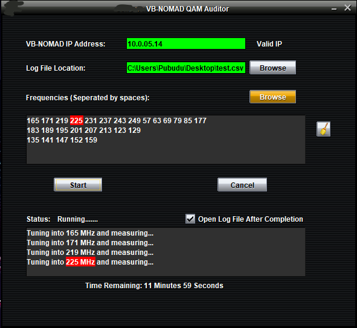

# Auditor

## Overview

This process was previously done by using a bash script. Customers using Windows had to install Cygwin to run this script, which some customers complained was complicated. This simple helper tool was designed to address this problem. It provides a simple and clear GUI and required no installation. Since it is written on Java it can be run on any platform. The entire operation can be completed within a few clicks. 

Please Click [Here](https://youtu.be/dYWTHK3TkKU) to see a brief demo.
 

